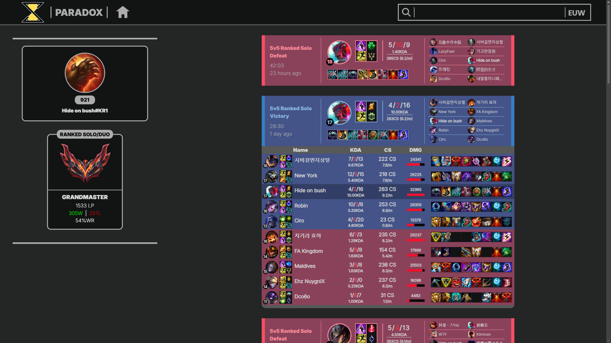
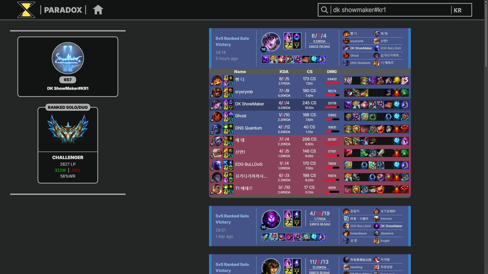
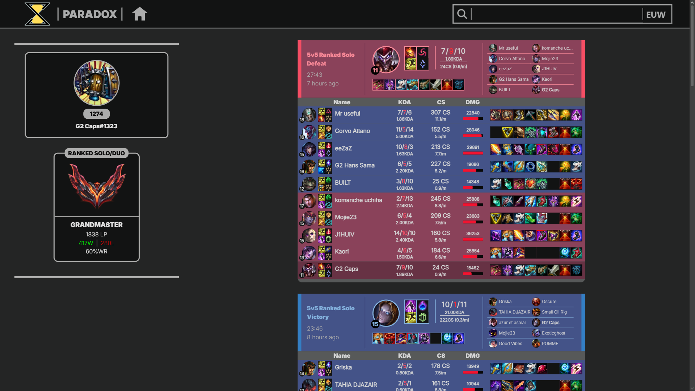

# Paradox - Frontend
A React + TypeScript frontend for browsing League of Legends summoner profiles, ranked stats, and match history - powered by the [Riot REST API](https://github.com/tomasz-gutkowski/riot-rest-api) backend.  
**Live demo:** [paradox-gg.vercel.app](https://paradox-gg.vercel.app)  
**Backend repo:** [riot-rest-api](https://github.com/tomasz-gutkowski/riot-rest-api)
## Features
- **Player search** by Riot ID and server, routed straight to a shareable profile URL
- **Data Dragon & Community Dragon** visual assets, dynamically fetched when needed
- **Profile overview** with ranked tier icons, summoner level, and core stats
- **Match history** with expandable match cards for full match details
- **Route-level data loading** via React Router loaders, with dedicated loading and error states
- **404 page** for unmatched routes, and automatic redirect from `/` to `/home`
## Tech stack
- React 19 + TypeScript
- Vite
- React Router v7 (data routers, loaders)
- Tailwind CSS 4
## Demo
The website is live at [paradox-gg.vercel.app](https://paradox-gg.vercel.app).  
After an extended period of inactivity, the first backend-dependent action can take 50+ seconds of additional time before the server wakes up.  

If you're not familiar with League of Legends, here are some example URLs to save you the trouble of finding valid Riot IDs for the demo:

| Player                                                | Server      | Riot ID          | URL                                                           |
|-------------------------------------------------------|-------------|------------------|-----------------------------------------------------------------|
| [T1 Faker](https://lol.fandom.com/wiki/Faker)         | Korea       | Hide on bush#KR1 | https://paradox-gg.vercel.app/profile/KR/hide%20on%20bush/kr1 |
| [DK Showmaker](https://lol.fandom.com/wiki/ShowMaker) | Korea       | DK Showmaker#KR1 | https://paradox-gg.vercel.app/profile/KR/dk%20showmaker/kr1   |
| [G2 Caps](https://lol.fandom.com/wiki/Caps)           | Europe West | G2 Caps#1323     | https://paradox-gg.vercel.app/profile/EUW1/g2%20caps/1323     |

(Riot IDs can change over time, so not all of the examples above may still be up to date)
### Examples
https://github.com/user-attachments/assets/def0cd10-06e8-42eb-b668-da3c293ddca3  






## Getting started
### Prerequisites
- Node.js 20+
- A running instance of [riot-rest-api](https://github.com/tomasz-gutkowski/riot-rest-api) (local or the live deployment above)
### Setup
```bash
git clone https://github.com/tomasz-gutkowski/paradox-web.git
cd paradox-web
npm install
cp .env.example .env
```
Point the frontend at a backend in `.env`:
```
VITE_BACKEND_URL=http://localhost:8080
```
### Run
```bash
npm run dev
```
The app will be available at `http://localhost:5173` (unless port 5173 is already in use).
### Build
```bash
npm run build
```